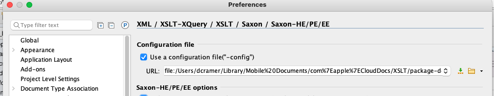

# Testing in Oxygen

1. In Oxygen, Preferences, in "XML / XSLT-XQuery / XSLT / Saxon / Saxon-HE/PE/EE" configure Oxygen to use the provided saxon-config.xml file:
   
   Note: This saxon-config.xml is what registers the package with Saxon. Using Saxon from the command line, you'd point to it (or a config like it) with the -config Saxon cli option.
2. Restart Oxygen.
2. Open using-a-b-c-packages.xsl and using-b-c-packages.xsl
2. Run these xslts in the debugger using any xml as input.
2. You should see output like the following, illustrating that the packages are being used.
   Play with the xslts until you feel comfortable with how packages work. There are many more features. For a good description of them and many other things, see Dimitre Novatchev's excellent Pluralsight class: 
   https://app.pluralsight.com/library/courses/xslt-3-0-whats-new-part1/table-of-contents

using-a-b-c-package.xsl:
```
<root>Hello From Package A!<packageB xmlns:xs="http://www.w3.org/2001/XMLSchema"
             xmlns:wooga="http://www.wooga.com/sample/xsl/package-demo">Hello From Package A!</packageB>
   <usingCMode>Hello From Package A![Book1 title]Hello From Package A![Chapter1 title]Hello From Package A![xincluded section]Hello From Package A![foobar]Hello From Package A![asdfdsa]Hello From Package A![Chapter title]Hello From Package A![xincluded section]Hello From Package A![foobar]</usingCMode>
</root>
```
using-b-c-package.xsl
```
<root>
   <packageB xmlns:xs="http://www.w3.org/2001/XMLSchema"
             xmlns:wooga="http://www.wooga.com/sample/xsl/package-demo">Hello From Package A!</packageB>
   <usingCMode>Hello From Package A![Book1 title]Hello From Package A![Chapter1 title]Hello From Package A![xincluded section]Hello From Package A![foobar]Hello From Package A![asdfdsa]Hello From Package A![Chapter title]Hello From Package A![xincluded section]Hello From Package A![foobar]</usingCMode>
</root>
```